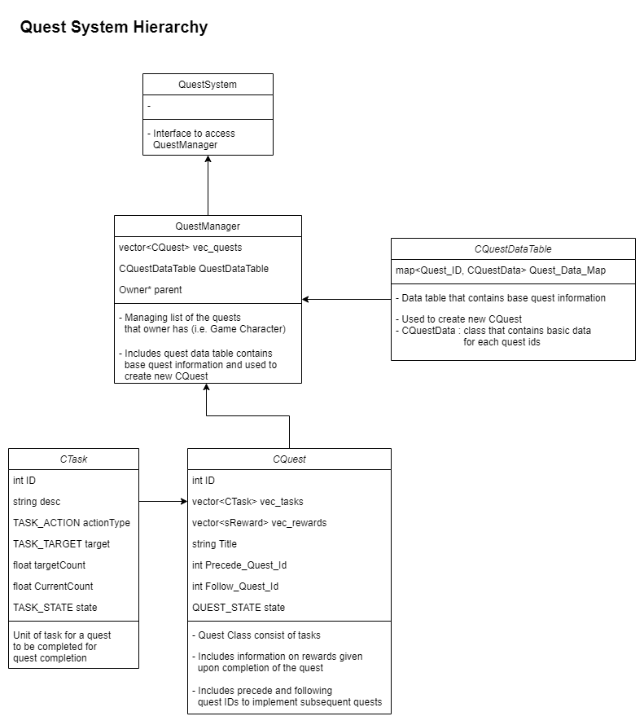

# BasicQuestSystem

## Introduction
- Simple quest system template written in c++.
- This Project runs on **Visual studio 2019**.
- 
## Features
- Quest system reads quest data table from **csv** file (Quest/Quest_Table.csv), and create quest dictionary.

-  Player's quest record is saved in **csv** file.

- Adopt **Observer pattern** to build quest system to interaction with player.
	-- By setting player as a "Subject" and quest system as an "Observer", 
	-- When player takes an action ( i.e. hunting monster ), it  sends notification to quest system and the system handles  the notification ( i.e. adding hunt count).

- Quest System Hierarchy
 
  -- Task is an unit of work for quest to be completed
  -- Quest consists of several tasks, and quest is completed when all tasks in the quest are completed.
  -- Quest Manager holds list of quests and manage status of the quests with input.

## External Source
- [CSV Reader] ben-strasser/fast-cpp-csv-parser: https://github.com/ben-strasser/fast-cpp-csv-parser
